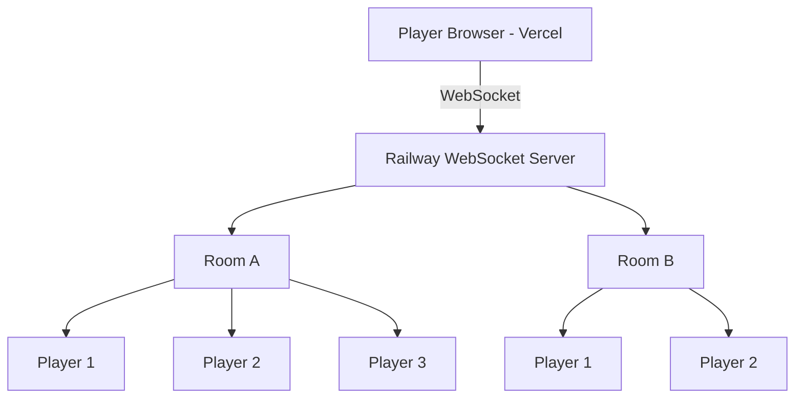

# Truth or Dare 🎲

A polished, mobile-first multiplayer Truth or Dare web application built for casual play between friends — shareable via a simple URL or Instagram.

---

## Table of Contents

1. [Project Overview](#project-overview)
2. [Architecture](#architecture)
3. [Why No Database](#why-no-database)
4. [Project Structure](#project-structure)
5. [Local Development](#local-development)
6. [Environment Variables](#environment-variables)
7. [Railway Deployment (Server)](#railway-deployment-server)
8. [Vercel Deployment (Frontend)](#vercel-deployment-frontend)
9. [WebSocket Message Flow](#websocket-message-flow)
10. [Room Lifecycle](#room-lifecycle)

---

## Project Overview

**Truth or Dare 🎲** is a real-time multiplayer game where friends can:

- Create a room and share the 6-character code
- Join via a URL (`/room/ABC123`) or by entering the code
- Take turns choosing Truth, Dare, or Random prompts
- Play entirely without accounts or sign-ups

---

## Architecture



| Layer             | Technology             | Host    |
|-------------------|------------------------|---------|
| Frontend          | Next.js 15 + TypeScript + Tailwind + Framer Motion | Vercel  |
| Multiplayer Server | Node.js + TypeScript + WebSocket (`ws`) | Railway |
| Database          | **None**               | —       |
| Game State        | In-memory (`Map<roomCode, Room>`) | Railway |
| Prompt Content    | Plain text files (`data/truths.txt`, `data/dares.txt`) | —  |

---

## Why No Database

This is a lightweight casual game. Room state only needs to live as long as the game session. Using a database would add complexity, cost, latency, and an external dependency with no benefit.

All room and game state is stored in the Node.js server's memory:

```
rooms = Map<roomCode, Room>
```

If the Railway server restarts, active rooms are lost. This is acceptable — players simply create a new room. No persistent data is ever written.

Truth/Dare prompts are stored as plain text files in the frontend project (`data/truths.txt`, `data/dares.txt`) and mirrored as arrays in the server (`src/prompts.ts`).

There is **zero database dependency** in this project.

---

## Project Structure

```
truth-dare/
├── truth-or-dare-web/          # Next.js frontend → Vercel
│   ├── app/
│   │   ├── layout.tsx
│   │   ├── page.tsx
│   │   └── room/[roomCode]/
│   │       └── page.tsx
│   ├── components/
│   │   ├── HomeScreen.tsx
│   │   ├── HomePageClient.tsx
│   │   ├── CreateRoom.tsx
│   │   ├── JoinRoom.tsx
│   │   ├── RoomLobby.tsx
│   │   ├── RoomPage.tsx
│   │   ├── PlayerList.tsx
│   │   ├── GameScreen.tsx
│   │   ├── GameOver.tsx
│   │   ├── PromptCard.tsx
│   │   ├── TurnIndicator.tsx
│   │   ├── ShareRoom.tsx
│   │   └── ConnectionStatus.tsx
│   ├── lib/
│   │   ├── types.ts
│   │   ├── websocket.ts
│   │   └── useGame.ts
│   └── data/
│       ├── truths.txt
│       └── dares.txt
│
└── truth-or-dare-server/       # Node.js WebSocket server → Railway
    └── src/
        ├── server.ts
        ├── rooms.ts
        ├── game.ts
        ├── prompts.ts
        ├── types.ts
        └── utils.ts
```

---

## Local Development

### Prerequisites

- Node.js 18+
- npm

### 1. Start the WebSocket server

```bash
cd truth-or-dare-server
npm install
npm run dev
# Listening on ws://localhost:3001
```

### 2. Start the frontend

```bash
cd truth-or-dare-web
npm install
cp .env.local.example .env.local   # already set to ws://localhost:3001
npm run dev
# Open http://localhost:3000
```

Open two browser tabs, create a room in one, join in the other.

---

## Environment Variables

### Frontend (`truth-or-dare-web`)

| Variable              | Description                       | Example                                         |
|-----------------------|-----------------------------------|-------------------------------------------------|
| `NEXT_PUBLIC_WS_URL`  | WebSocket server URL              | `wss://your-app.up.railway.app` (production)    |

Copy `.env.local.example` → `.env.local` for local development.

### Server (`truth-or-dare-server`)

| Variable | Description       | Default |
|----------|-------------------|---------|
| `PORT`   | Port to listen on | `3001`  |

Railway sets `PORT` automatically.

---

## Railway Deployment (Server)

1. Create a new Railway project.
2. Connect your GitHub repository (or push directly).
3. Set the **root directory** to `truth-or-dare-server`.
4. Railway will auto-detect Node.js. Set the start command:
   ```
   npm run build && npm start
   ```
5. Railway automatically provides the `PORT` environment variable.
6. The server binds to `0.0.0.0:PORT` and handles WebSocket upgrades.
7. Copy the Railway-provided URL (e.g., `wss://truth-or-dare-server.up.railway.app`).

> No environment secrets needed — the server has no database and no API keys.

---

## Vercel Deployment (Frontend)

1. Push `truth-or-dare-web` to GitHub.
2. Import the project in Vercel.
3. Set **root directory** to `truth-or-dare-web`.
4. Add environment variable:
   ```
   NEXT_PUBLIC_WS_URL = wss://your-railway-server.up.railway.app
   ```
5. Deploy.

Production flow:

```
User → Vercel (Next.js) → wss://Railway → In-memory Rooms
```

---

## WebSocket Message Flow

### Client → Server

| Message          | Description                              |
|------------------|------------------------------------------|
| `CREATE_ROOM`    | Create a new room, become host           |
| `JOIN_ROOM`      | Join an existing room by code            |
| `LEAVE_ROOM`     | Leave the current room                   |
| `PLAYER_READY`   | Toggle ready state in lobby              |
| `START_GAME`     | Host starts the game (all must be ready) |
| `SELECT_TRUTH`   | Current player selects Truth             |
| `SELECT_DARE`    | Current player selects Dare              |
| `SELECT_RANDOM`  | Current player selects Random            |
| `NEXT_TURN`      | Current player advances to next turn     |

### Server → Client

| Message          | Description                                      |
|------------------|--------------------------------------------------|
| `ROOM_CREATED`   | Room created successfully (→ creator)            |
| `ROOM_JOINED`    | Joined room successfully (→ joiner)              |
| `ROOM_STATE`     | Full room state update (→ all)                   |
| `PLAYER_JOINED`  | New player joined (→ all except new player)      |
| `PLAYER_LEFT`    | Player disconnected (→ all)                      |
| `PLAYER_READY`   | Player ready state changed (→ all)               |
| `GAME_STARTED`   | Game started (→ all)                             |
| `PROMPT_SELECTED`| Prompt was selected and revealed (→ all)         |
| `TURN_CHANGED`   | Turn advanced to next player (→ all)             |
| `ERROR`          | Server-side error message (→ requester)          |
| `ROOM_CLOSED`    | Room was deleted (→ all remaining)               |

---

## Room Lifecycle

```
CREATE_ROOM
    │
    ▼
[lobby] ←─── PLAYER_READY (toggle)
    │
    │  START_GAME (host, all ready, ≥2 players)
    │
    ▼
[playing]
    │   ┌─────────────────────────┐
    │   │ SELECT_TRUTH / DARE /   │
    │   │ RANDOM → PROMPT_SELECTED│
    │   │ NEXT_TURN → TURN_CHANGED│
    │   └─────────────────────────┘
    │  (host ends game / only 1 player left)
    ▼
[ended]
    │  Play Again → back to [lobby]
    │  Back Home → leave room
    ▼
[deleted] (no connected players / 30min inactivity)
```

---

## Security Notes

This is a casual POC, not an enterprise system. There are no user accounts.

The server validates:
- Room existence before joining
- Player identity before acting (player ID must match socket metadata)
- Host-only actions: `START_GAME`, `END_GAME`
- Turn-only actions: `SELECT_TRUTH`, `SELECT_DARE`, `SELECT_RANDOM`, `NEXT_TURN`
- All incoming messages are parsed and type-checked

The server is authoritative — clients cannot fake game state.

---

*Made with ❤️ using Next.js, TypeScript, WebSockets, Tailwind CSS, and Framer Motion.*
